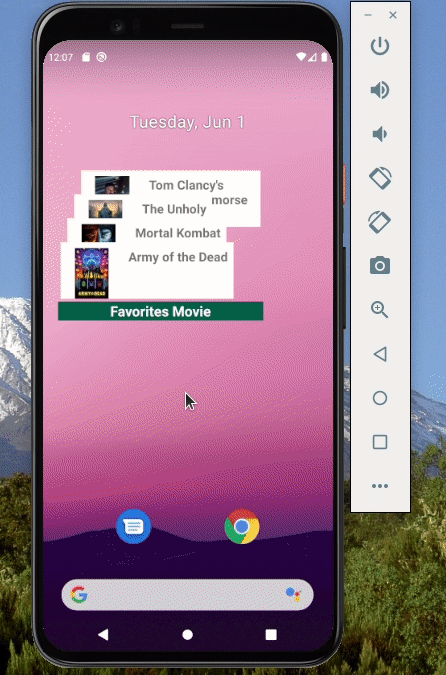
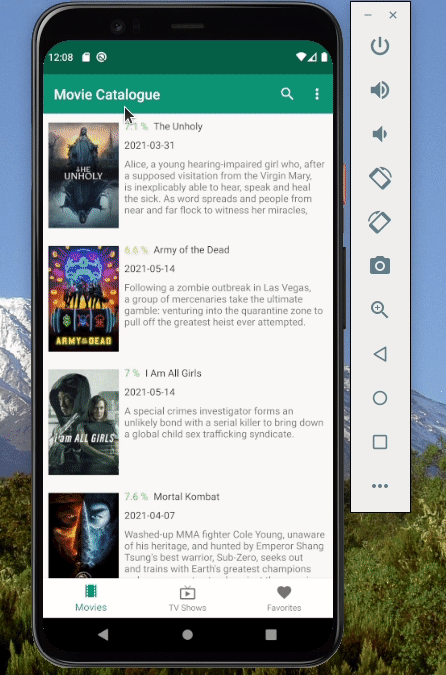

# MADESubmission
My Dicoding MADE Course Submission.    
Create a simple Movie Catalogue app using open TMDB API, which users can see movie overview, save it to favorite so user can view it locally, and display the favorited movies on the widgets

##### Table of Contents  
[Displaying List of Movies and TV Shows from API](#fetching-list-of-data-from-tmdb-api-and-displaying-it)  
[Movie to Favorites List and Removes it](#add-movie-to-favorites-list-and-removes-it)  
[Search](#search-features)  
[Widgets](#and-we-also-have-widgets) 
 
 

### Fetching List of Data from TMDB API and Displaying it
<!-- <a name="displaylist"/> -->
displaying list of Data fetched from TMDB API  

 
 

<!-- <a name="favorite"/> -->
### Add Movie to Favorites List and Removes it

 
 

<!-- <a name="search"/> -->
### Search Features

 
 

<!-- <a name="widgets"/> -->
### and we also have Widgets

